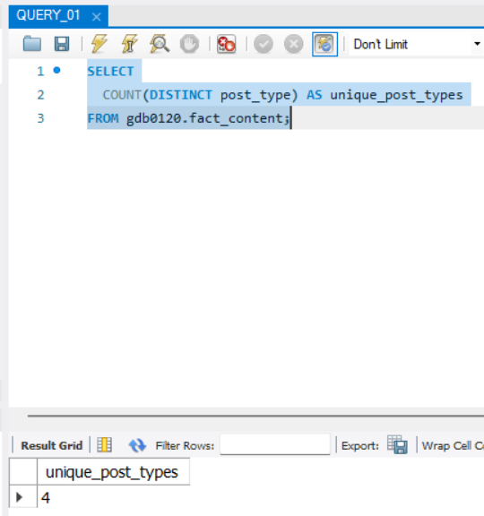
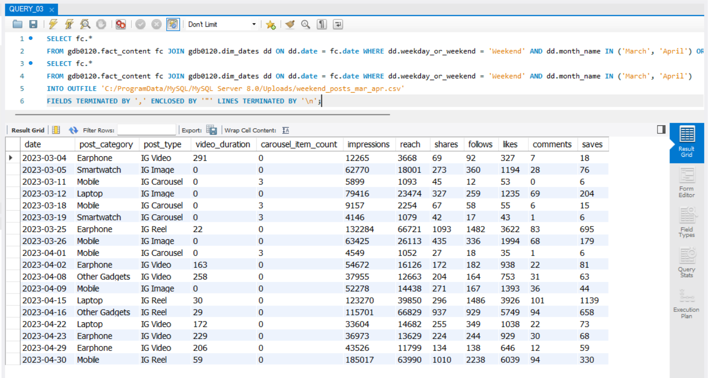
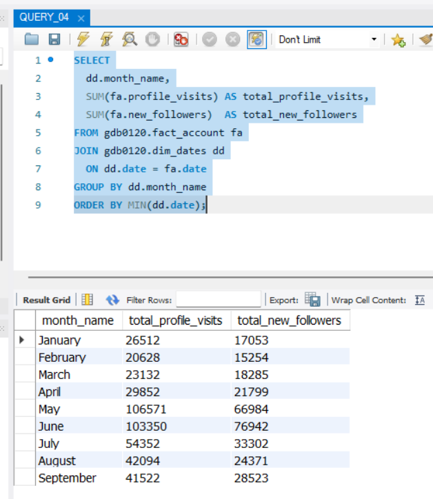

# Instagram Tech Influencer Analysis (SQL)
This project was completed as part of the Codebasics Virtual Internship.

## Objective
Analyze Instagram influencer performance data using SQL to derive insights on reach, engagement, impressions, and follower growth.

## Files Included
- sql_questions.pdf → Assignment questions

- QUERY_01.sql to QUERY_10.sql → SQL solutions

- Q1_output.csv to Q10_output.csv → Query results (outputs)

## Key Analysis
- Unique post types identification

- Highest & lowest impressions by content format

- Weekend posting analysis

- Monthly profile visits & follower growth

- Post category engagement analysis

- Reach percentage by post type

- Quarterly engagement trends

- Share behaviour analysis

## Tools Used
- MySQL

- SQL

## Question 01 – How many unique post types are found in the 'fact_content' table?

### SQL Query

```sql
SELECT
COUNT(DISTINCT post_type) AS unique_post_types
FROM gdb0120.fact_content;
```
### Output



## Question 02 – What are the highest and lowest recorded impressions for each post type? 

### SQL Query

``` SELECT
  post_type,
  MAX(impressions) AS highest_impressions,
  MIN(impressions) AS lowest_impressions
FROM gdb0120.fact_content
GROUP BY post_type
ORDER BY post_type;
```
### Output


## Question 03 – Filter all the posts that were published on a weekend in the month of March and April and export them to a separate csv file.

### SQL Query

``` SELECT fc.*
FROM gdb0120.fact_content fc 
JOIN gdb0120.dim_dates dd ON dd.date = fc.date 
WHERE dd.weekday_or_weekend = 'Weekend' 
AND dd.month_name IN ('March', 'April') 
ORDER BY fc.date, fc.post_type;

SELECT fc.*
FROM gdb0120.fact_content fc 
JOIN gdb0120.dim_dates dd ON dd.date = fc.date 
WHERE dd.weekday_or_weekend = 'Weekend' 
AND dd.month_name IN ('March', 'April')
INTO OUTFILE 'C:/ProgramData/MySQL/MySQL Server 8.0/Uploads/weekend_posts_mar_apr.csv'
FIELDS TERMINATED BY ',' 
ENCLOSED BY '"'
 LINES TERMINATED BY '\n';
```
### Output



## Question 04 – Create a report to get the statistics for the account. The final output includes the following fields: 

• month_name 

• total_profile_visits 

• total_new_followers

### SQL Query

``` SELECT
  dd.month_name,
  SUM(fa.profile_visits) AS total_profile_visits,
  SUM(fa.new_followers)  AS total_new_followers
FROM gdb0120.fact_account fa
JOIN gdb0120.dim_dates dd
  ON dd.date = fa.date
GROUP BY dd.month_name
ORDER BY MIN(dd.date);
```
### Output




